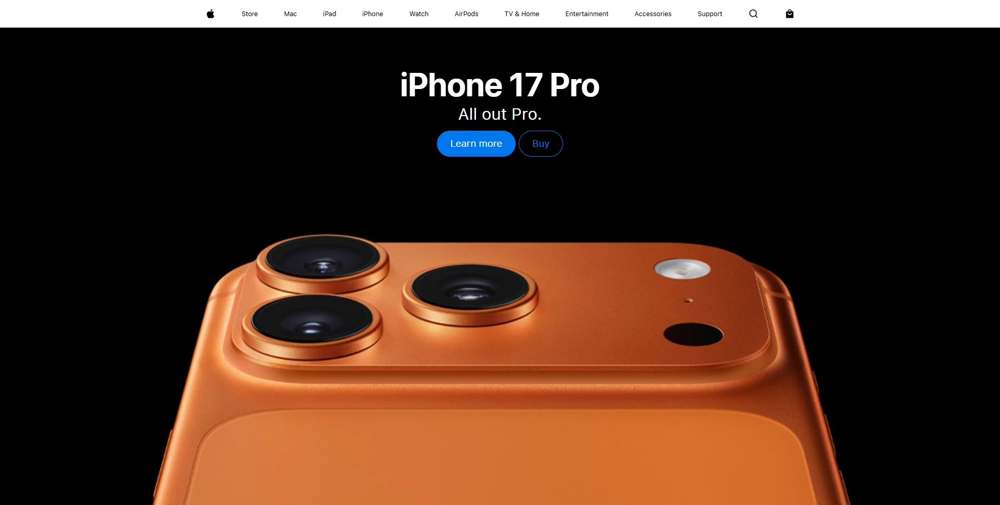

# 🍏 Apple Website Landing Page

A visually stunning **Apple-inspired landing page** showcasing a hero section with full-screen background, interactive buttons, and a clean navigation bar.  
Built using **HTML** and **CSS**, this project highlights modern typography, responsive design, and subtle hover interactions.

---

## ✨ Features

- Full-screen hero section with iPhone 17 Pro background  
- Header navigation bar with Apple-style menu items  
- Interactive buttons: "Learn More" and "Buy"  
- Custom fonts: *SF Pro Display* & *SF Pro Text*  
- Minimal, clean, and modern Apple-inspired design  

---

## 🌐 Live Demo

You can view and interact with the project online here:  
👉 [Apple Landing Page Live Demo](https://harsh-codes-hub.github.io/Apple-Website-Landing-Page-TASK4/)

---

## 🗂️ File Structure
```bash
Apple-Website-Landing-Page-TASK4/
│
├── index.html # Main HTML file for landing page layout
├── style.css # CSS styling for layout, typography, and buttons
│
├── /fonts/ # Custom fonts folder
│ ├── sf-pro-display_regular.woff2
│ ├── sf-pro-display_semibold.woff2
│ ├── sf-pro-display_bold.woff2
│ ├── sf-pro-text_regular.woff2
│ └── sf-pro-text_semibold.woff2
│
├── /favicon/ # Website icons and web manifest
│ ├── apple-touch-icon.png
│ ├── favicon-16x16.png
│ ├── favicon-32x32.png
│ └── site.webmanifest
│
├── hero_iphone_17_pro__bknyzxfk2agi_large.jpg # Hero background image
│
├── preview.webp
│
└── README.md # Project documentation
```

---

## 💻 Usage

1. **Clone the repository:**
   ```bash
   git clone https://github.com/harsh-codes-hub/Apple-Website-Landing-Page-TASK4.git
   ```
2. **Navigate to the project directory:**
   ```bash
   cd Apple-Website-Landing-Page-TASK4
   ```
3. **Open the project in your browser:**
   ```
   open index.html
   ```
   or simply double-click on **index.html**.

---

## 🧠 Learning Highlights

- Practiced modern header navigation design
- Implemented full-screen hero sections with background images
- Used custom Apple fonts for typography consistency
- Styled interactive buttons with hover effects
- Learned to structure landing page layouts using HTML & CSS

---

## 📸 Preview

A sleek Apple-inspired landing page with hero section and interactive buttons.


---

## 🛠️ Built With

- HTML5
- CSS3
- Flexbox
- Custom SF Pro Fonts

---

## 👨‍💻 Author

**Cohort 2.0 – Batch Task 4 Submission**  
Created by **Harsh Gajrani** *(Harsh Codes Hub)*  
Part of the **Cohort 2.0 batch at Sheryians Coding School**

---

_⭐ If you found this project helpful or inspiring, please consider giving it a star on GitHub!_